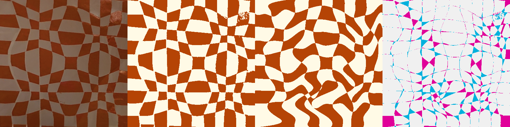
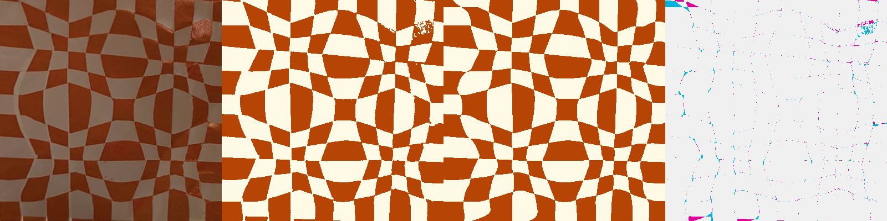

# Tilted orange heart — 2026-09-08

**Follow-up:** automatic cropping is now available for this photo and the
subsequent upload screenshot. See [ORANGE-CROPPER.md](ORANGE-CROPPER.md). The
measurements below preserve the earlier investigation and manual-crop baseline.

The supplied photograph is preserved unchanged in
`scripts/inverse/fixtures/hard-user/tilted-orange-weave.png`. The manifest records
visual corner landmarks with an estimated 15-pixel uncertainty. They are a fixed
diagnostic crop, not measured ground truth. No original cutting paths are known.

Two independent failures were reproduced:

1. **Automatic cropping returns no candidate.** The pale paper has weak contrast
   against the background. The existing colour mask cannot supply both lower
   edges; adaptive and pale-palette models also reject the textured background.
   A rough selection and simple exposure changes did not resolve it. An
   experimental hull of the main coloured component recovered a silhouette but
   misplaced the notch and tip, so it was not shipped. The lobe-outline objective
   also moved a manually guided initialization away from the visible landmarks.
   Colour segmentation and the flat-heart outline model need further work here.
2. **The old fitter excluded the required dense grids.** Its maximum was eight
   slits per sheet. On this crop, repeated inset measurements give 11/10 counts
   on one pair of opposing sides and 10/9 on the other. They are noisy evidence,
   not consistent hard endpoint constraints. Increasing the allowed hypotheses
   lets the fitter recover a ten-slit pair from fresh grids.

| Fixed diagnostic crop | Previous ceiling | Current dense search |
|---|---:|---:|
| Independently rendered mask disagreement | 14.15% | **1.69%** |
| Preparation + fitting + validation + export | 24.41 s | **19.58 s** |
| Slits per sheet | 8 | 10 |
| Geometry and paper checks | pass | pass |
| Image quality target | fail | **pass** |

The first count-only change reached 1.72% in 9.57 seconds in Node, but browser
replay exposed insufficient refinement time. Dense grids can now use up to
18 seconds for the first candidate when the requested budget permits it; the
ordinary eight-slit search is unchanged. All 22 frozen regular Hunodan inputs
retain exactly the previous count hypotheses.

The new search expands beyond eight only when a majority of inset measurements
on **both opposing edges** indicate more than eight slits. It keeps lower counts
and both phases available, includes one extra count for uncertainty, and caps
the search at 16. Physical strip-width limits still apply. A single noisy row or
one inconsistent edge cannot expand the search. This is still a finite search,
not coverage of arbitrarily dense designs.

The independent interior error drops from 14.23% to 1.30%; error in the outer
5% band drops from 13.82% to 3.33%. That establishes a substantial fitting failure
separate from cropping. The remaining difference includes border placement and
small photographic highlights; it is not a measured difference from original
artwork. Identical templates cannot meet the requested allowance on this fixed
mask: its diagonal lower bound is 23.88%.

Each comparison shows the rectified photograph, classified target, independently
rendered exported geometry, and disagreements (magenta: target colour missing;
cyan: extra colour). The fitted crop never moves to improve this score.

Before:

After:

Run `node scripts/inverse/hard-user-benchmark.mjs` to repeat detection and fitting.
`HARD-ORANGE-VALIDATION.json` records source checksum, settings, counts, timings and
region errors. SVGs, geometry and full reports are saved under the printed output
directory. Automatic cropping remains a known failure; the web app's manual
corner flow is the current way to use this photograph.

Browser replay also exposed a source-mask difference: a roughly 3.4 mm² white
island near (91.1, 14.0) mm appears at a glossy highlight in the browser-decoded
image. The screenshot contains a `Color LCD` ICC profile; its Node and browser
classifications are not identical. We have not established the profile as the
sole cause. Some browser fits omit this island, so the unchanged feature audit
correctly keeps `templateChecksPassed: false`, even below 3% overall disagreement.
The UI now explains the missing-region warning directly. This remains a review
case, not an unconditional end-to-end success. Neither the target mask nor the
feature threshold was changed to obtain a pass.

Final production browser replay (same manual landmarks, actual downloaded ZIPs):

| Browser | Independent image difference | Solver time | Remaining review warning |
|---|---:|---:|---|
| Chromium | 1.67% | 32.20 s | tiny highlight region omitted |
| Firefox | 1.90% | 16.79 s | none |
| WebKit | 1.99% | 33.03 s | tiny highlight region omitted |

All three pass the geometry and paper checks and retain the mask, comparison
and downloads. Chromium and WebKit still fail the unchanged feature-retention
audit for the stated tiny region; their results remain marked for review.
Browser timings above are solver time, excluding preparation and final export.
