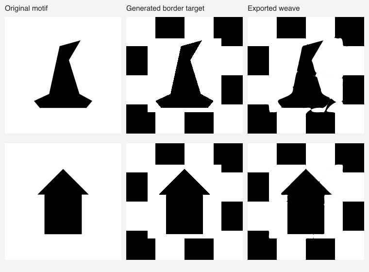

# Creating a heart from a motif, or repairing its border

The [flettedehjerter.dk archive](https://flettedehjerter.dk/) suggests a useful design workflow: a central silhouette accompanied by a supporting weave near the edges. [Issue #8](https://github.com/thomasahle/julehjerte/issues/8) requests a Moomin house; [issue #9](https://github.com/thomasahle/julehjerte/issues/9) requests a wizard's hat. Neither issue contains a reference drawing. The experiment below uses generic original house and hat silhouettes, not purported reconstructions of those requested designs.

## Implemented feasibility experiment

The results below are the historical direct-fitter baseline. The subsequent [straight-artwork correction](STRAIGHT-ARTWORK.md) removes the bumps in the four-cell examples and reports a fresh replay of all six seeds.

`scripts/inverse/motif-border-benchmark.mjs` constructs a square binary silhouette, substitutes a checker pattern only in an outer band, and runs the existing automatic fitter from fresh grids. It tests three, four and five checker cells per side. Exported cubic paths are independently rendered with resvg. All candidates and their geometry/paper checks are retained, and a separate centre error determines which valid candidate is best.

```sh
node scripts/inverse/motif-border-benchmark.mjs
# Short replay of the strongest seed from this experiment:
node scripts/inverse/motif-border-benchmark.mjs --cells=4 --output=tmp/motif-replay
```

The requested band is 18% of the square width on each edge, rounded to image pixels. The protected centre is about 40% of the image area. This is a substantial supporting border, not evidence that a very narrow repair band will suffice. Both fixture silhouettes fit entirely inside the protected region before fitting. No pixel of the centre is changed when making the target; the fitter may still introduce measurable residual errors there.

| Motif | Checker cells per side | Protected-centre disagreement | Whole prepared-target disagreement | Geometry / paper-core checks |
| --- | ---: | ---: | ---: | --- |
| Hat | 3 | 2.46% | 0.99% | Pass / pass |
| Hat | 4 | **0.97%** | 0.43% | Pass / pass |
| Hat | 5 | 6.88% | 4.72% | Pass / pass |
| House | 3 | 4.60% | 1.89% | Pass / pass |
| House | 4 | **0.09%** | 0.04% | Pass / pass |
| House | 5 | 3.03% | 1.44% | Pass / pass |

The first six runs used a ten-second solver budget and took 6.9–11.2 seconds each including preparation, validation and export. The best candidates used three slits per sheet. These are two synthetic examples, not a benchmark of arbitrary uploaded motifs or physical assembly.



The preview comes from a fresh replay of the four-cell seed. [Measurements](MOTIF-BORDER-VALIDATION.json) retain the first six runs and replay results. Numerical outcomes may vary with the time budget and host load.

## What the experiment establishes

A generated border can supply a useful starting topology for isolated motifs. It also exposes a scoring failure: a large, accurately reconstructed border can dilute errors in the centre. The three-cell house passes the existing overall-image threshold despite 4.60% disagreement in the protected centre. A user-facing motif workflow must evaluate the centre separately before calling such a result successful.

The prototype is a benchmark script; it does not add a mode to the website. It explores fixed checker-border proposals. It does not yet optimize arbitrary permitted edits to the border, guarantee an exact central silhouette, or choose a border width automatically.

## Proposed generator behavior

Use one robust solver with an explicit artwork operation, rather than reviving the old solver-style choices:

- **Create from a motif:** accept a drawing or uploaded silhouette, preserve its aspect ratio, place it inside a visible protected region, and add supporting weave around it. Orient the motif as it should appear in the finished heart.
- **Repair the border:** keep the accepted photo crop fixed. Show an editable outer band and permit target changes there while retaining the central design.

Both operations need the same selection policy: first satisfy geometry and the protected-region error bound, then prefer simpler cutting paths, matching sheets within the existing one-percentage-point allowance, and smaller border changes. Reject improvements that come only from increasing the editable region. Border width must be an explicit part of the experiment and UI, not a hidden optimization variable.

Keep the original, proposed target and exported weave available for comparison. Distinguish intended border edits from remaining centre errors in the overlay. Report protected-region error, border changes and full-image difference separately; do not relabel editable pixels as unobserved pixels to conceal changes.

For the general hybrid algorithm, border targets can start with a small set of grid phases/counts, followed by refinement with a separate penalty on border edits. A neutral probability of 0.5 is **not** sufficient to make the existing optimizer ignore a region: its squared-error grid loss still attracts predictions toward 0.5, and several ranking stages threshold probabilities. Explicit loss weights and consistent scoring through initialization, refinement, matching and export validation are needed before offering unrestricted border repair.

The new [photo corpus](WEB-PHOTOS.md) also shows failures that this operation would not address: printed-paper decorations and poor colour separation inside the protected centre. Those remain preprocessing problems.
