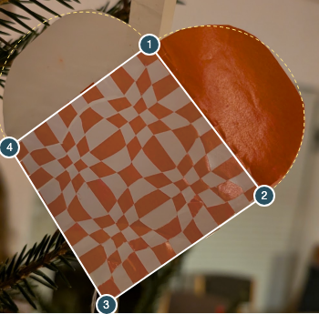

# Automatic crop recovery for the orange photograph

The September 8 12:54 screenshot reproduced the same orange photograph already
stored in `scripts/inverse/fixtures/hard-user/tilted-orange-weave.png`, with
slightly different framing. The photograph as shown in the new UI screenshot
is also preserved as `orange-upload-1254.png`; the manifest records its exact
screenshot extraction rectangle. Previously
the app found zero corners. The new fallback supplies four editable corners
without a rough selection or manual coordinates.

## Cause and change

The original paper mask uses a brightness threshold for the pale sheet. In this
scene, shadowed pale paper can fall outside that mask while parts of the
background enter it. The subsequent plain-background palette models reject the
textured scene. Neither supplies the continuous silhouette expected by the
lower-edge finder.

The fallback isolates the main red/orange component, closing small gaps before
selecting it so separate background objects do not determine its outline. Its
convex hull supplies an interior sample of the pale paper colour and seeds the
lower edges. The pale colour estimate scales with exposure. The original source
pixels are never changed.

The shape fit uses both lobe colour boundaries and allows independent lobe
depths. If the pale outer arc blends into the background, the coloured outer arc
and strong transitions at **both** overlap edges must support the proposal.
Lower-edge sampling includes narrow rows away from the image centre. Coarse
shape starts help avoid different local minima after resizing or changing
exposure. No solver loss, reference template, saved slit count or manual corner
coordinates enter detection.

This fallback runs only after the existing detectors fail. Its result always
has `needs_review` status: the photo does not uniquely determine concealed
paper geometry. The upper overlap corner is an estimate; it is not an assertion
that the visible notch and the inferred overlap intersection coincide exactly.

## Verification

`anchored-crop.test.mjs` checks three dim paper palettes on textured synthetic
backgrounds, in both colour orientations. Their known corners are recovered
within four pixels. Coloured circles, rectangles and checker diamonds without
lobes remain rejected. The supplied photo gets a proposal after ±10% exposure,
half-size resampling, padding and a rough selection; corresponding corner
movement stays below 16 original-image pixels. This bound measures stability,
not accuracy against unavailable ground truth.

The Node reconstruction on the automatically detected crop has 1.69125%
independently rendered mask disagreement and passes geometry, paper and feature
checks. Preparation, fitting, validation and export took 17.86 seconds; detection
is separate. This score is against the newly classified automatic crop and is
not directly interchangeable with the earlier manual-crop score.

Inverse test files now run serially because their solvers have wall-clock
budgets. The first concurrent full run exposed a yellow-star timeout under CPU
contention; its isolated replay passed without changing the solver or budget.

Full evidence and browser measurements are in `ORANGE-CROPPER-VALIDATION.json`.
The source screenshot's embedded colour profile can produce slightly different
classified masks across browser engines; the normal review notices and checks
remain in force.

The actual upload flow passed in Chromium, Firefox and WebKit for both the
original screenshot and the photograph extracted from the latest UI screenshot.
All six runs used automatic coordinates without edits, then prepared the crop,
fitted curves, downloaded the ZIP and independently rendered its geometry.
Image disagreement ranged from 1.73% to 2.08% for the latest screenshot; solver
time was 16.87–32.83 seconds. Geometry and paper checks pass. The tiny photographic
region warnings remain visible where a browser's classified mask includes them.

Reload the generator before retrying: an existing page can retain its previously
loaded worker code. The proposed corners remain draggable and numerically
editable; the new detector does not lock them or alter the accepted crop later.
