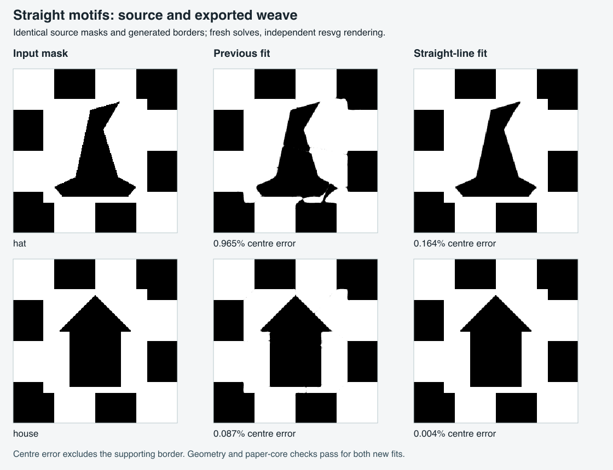

# Straight artwork without fitted bumps

This is the historical experiment that introduced a separate automatic line-art route. That route has since been removed: [straight and curved spans now share the main Bézier fitter](UNIFIED-FITTER.md). The measurements below describe the earlier implementation.

The reported hat screenshot exposed three separate problems:

1. Automatic routing required transpose symmetry before considering polygonal MILP reconstruction. The asymmetric hat therefore went directly to the flexible Bézier fitter, which approximated its straight edges with unnecessary bends.
2. Polygonal tracing used a fixed 0.35 mm RDP tolerance. At 240 pixels across a 100 mm square, that is smaller than one pixel. Diagonal raster stairs produced 118 segments. Simply increasing the tolerance still pinned fitted edges to selected pixel corners, introducing a systematic positional bias.
3. The target sampler disagreed with its own half-open crossing convention at left-edge endpoints. When a validation scanline passed exactly through a transition, it could invert the entire row. This caused repeated false MILP rejections. An analytic rectangle regression tests both phases and positions immediately above, on and below each transition.

The new automatic route considers asymmetric flat-colour line artwork as well. It simplifies at a tolerance of at least 1.2 source pixels, fits straight spans to the raster boundary by orthogonal least squares, and intersects adjacent lines to place corners. Strong horizontal and vertical runs retain their dominant coordinate. Chain endpoints stay fixed so independently traced chains retain their common junctions. Corner movement and distances to the raster boundary are checked; unsupported adjustments fall back to the RDP points. The reverse distance check is sampled, not an exact Hausdorff certificate.

The first independently validated MILP candidate may finish the asymmetric line search early. Acceptance still requires at most 1% disagreement against the original classified mask, feature preservation, geometry checks and paper-core checks. Matching sheets retain the existing one-percentage-point preference. If tracing fails these checks, the direct fitter receives the remaining budget.

Photographic crops still start with direct fitting. A heuristic for consecutive gentle turns keeps asymmetric rounded artwork on that fitter too; this is a conservative routing choice, not a general curve-recognition guarantee. Imported SVG curves are preserved as before. No additional solver-style choice is exposed to users.

Strict identical-sheet tracing retains RDP line positions. The 600-pixel published-star regression exposed a limitation of independent line adjustment: the resulting mirrored candidate graph became infeasible, even with MILP coefficient normalization. The automatic 400-pixel star still solved, but that was insufficient regression coverage. Conservatively retaining the established line positions for strict mirror routing restores the reference case; jointly optimizing those positions and routing remains future work. Independent-sheet results still undergo the normal matching-sheet preference after solving.

## Measured results

For the four-cell border shown in the screenshot, using the same masks and 10-second total budget:

| Motif | Centre error before → after | Local elapsed time before → after | Exported curved spans before → after |
| --- | ---: | ---: | ---: |
| Hat | 0.965% → **0.164%** | 9.32 s → **1.40 s** | 103 → **0** |
| House | 0.087% → **0.004%** | 6.32 s → **1.11 s** | 95 → **0** |

The new exports contain 60 and 49 straight spans respectively, including hidden connections and subdivision at routing portals. Geometry and paper-core checks pass. Errors come from resvg rendering the exported cuts against the original binary centre, not from the fitter's own renderer. Timings include preparation, fitting, validation, export and independent rendering on this machine.



All six production-browser replays pass. The hat takes 0.76/3.42/1.06 seconds in Chromium/Firefox/WebKit; the house takes 0.62/2.31/0.92 seconds. Those times cover the solve button through the checked-result heading, with normal UI defaults. Downloaded cuts have the same centre errors in every browser. [Recorded measurements and source hashes](STRAIGHT-ARTWORK-VALIDATION.json).

The broader six-seed experiment still exposes routing limitations. The three-cell house now also reconstructs with 0.004% centre error. The three-cell hat exhausts its line-routing budget after candidates fail the slit-neck checks; the five-cell hat times out without a candidate; the five-cell house's finite candidate graph is infeasible. Their direct fallbacks have 3.27%, 7.01% and 3.10% centre disagreement respectively. These are retained in the measurements, not presented as successful clean reconstructions. The four-cell seed is therefore still the selected hat candidate. This change fixes the shown conversion problem, not arbitrary border topology.

## Verification

Final verification: 132 Vitest tests and 147 inverse-engine tests pass, plus all six production-browser replays. Lint and the production build pass. Svelte checking reports zero errors and eight existing editor warnings. Nested local checkouts are excluded from linting and development file watching, so their edits do not reload an active upload or solve.

`straight-artwork.test.mjs` checks the scanline convention, hat and house preparation at 160/240/360 pixels with zero and 0.35-pixel translations, square house eaves, curved-motif routing, and two complete fresh solves. It verifies that exported control points describe straight spans and independently renders the exported templates with resvg. The centre error excludes the supporting border so the grid cannot dilute motif defects. Existing automatic star tests compare the result with published cutting paths.

```sh
node --test --test-concurrency=1 scripts/inverse/straight-artwork.test.mjs scripts/inverse/automatic.test.mjs
node scripts/inverse/motif-border-benchmark.mjs --output=tmp/straight-artwork
PLAYWRIGHT_MODULE=/path/to/playwright/index.mjs node scripts/inverse/straight-artwork-browser-test.mjs
```

The browser replay uploads generated PNGs, selects the whole square, prepares and solves through the real worker, downloads the ZIP, and independently checks its cutting paths. It also visits both templates, the original paths/mask and comparison view. It does not inject fitted solutions.

Browser QA also caught premature fallback in Firefox. The traced geometry and every normalized MILP coefficient matched Chromium exactly, but Firefox took about 2.9 seconds to solve that model, close to the old three-second cutoff. The independent-line attempt now gets up to five seconds (at most half the requested total budget), rather than discarding a clean reconstruction just before completion. Other routing budgets are unchanged.

The original [motif-border study](MOTIF-BORDER.md) remains the historical baseline. These are synthetic motif experiments, not evidence that arbitrary photographs or every supporting border can be solved exactly.
