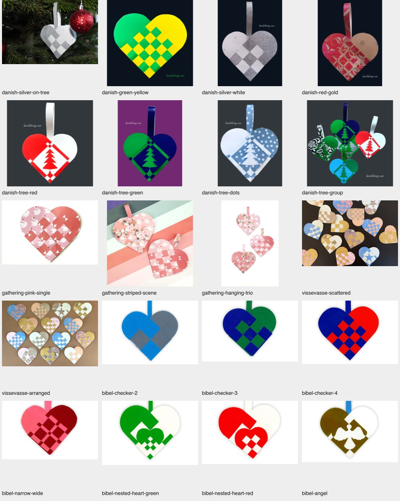

# Expanded real-photograph dataset

Added 20 source photographs and 44 selected heart instances from Bibelselskabet, Danish Things, Gathering Beauty and ViSSEVASSE. All retain original bytes, attribution, URLs, checksums and published-template links. Related photographs are grouped by family. These are not 44 independent designs.

[Dataset and commands](../../scripts/inverse/fixtures/web-photos/README.md) · [Machine-readable baseline](WEB-PHOTOS-BASELINE.json)

## First pass, 2026-09-08

The Node benchmark uses the same detector, preparation and automatic solver modules as the site. It receives only source pixels and the pre-annotated rough rectangle for group photos. This run does not replace browser QA. No detector, classifier or fitter was tuned on these new cases before recording the results.

- 29/44 selections produced a crop proposal and prepared mask.
- 15/44 produced no crop. These remain in the denominator and report.
- All 29 proposals were marked for review by the detector. Proposal presence is not a crop-accuracy score.

Visual inspection exposed distinct problems:

1. **Cropping:** the silver heart hanging on a tree includes lobe/background pixels in its proposed overlap square.
2. **Colour conversion:** the blue/green 3x3 checker photograph becomes mostly vertical bands. This loses genuine cells before the fitter runs.
3. **Printed paper:** stripes, dots, swans and flowers on the paper become false weave boundaries. These inputs violate the uniform two-colour assumption even when their crop is plausible.
4. **Glitter:** a plausible silver/white crop still contains many false tiny holes from highlights and texture.

These observations are recorded separately from fitting errors. Template links are retained, but the new published cuts have not been digitized or independently audited.

## Solver integration smoke check

Three predetermined examples were run with a ten-second solver budget, followed by an independent resvg rendering of the exported cubic paths. Total times include decoding, detection, preparation, fitting, validation and exporting.

| Photograph | Total time | Estimated-mask disagreement | Candidate checks |
| --- | ---: | ---: | --- |
| Red/white tree | 11.58 s | 7.02% | Needs review |
| Blue/green 3x3 checker | 8.11 s | 1.70% | Passed, but classified input is visibly wrong |
| Red/white nested heart | 11.24 s | 2.94% | Passed |

The checker example demonstrates why candidate checks cannot substitute for visual or published-template evaluation. All three runs checked exported geometry; the numerical scores compare with the estimated image mask, not the original cutting paths. Border/unknown pixels are excluded from error only when the source validity mask says they are unobserved.

Full initial visual reports are generated locally at `tmp/inverse-web-photos/initial-prepare/report.html` and `tmp/inverse-web-photos/solve-smoke/report.html`. Rerun with the documented commands to recreate them; source inputs are committed and the benchmark requires no network.
